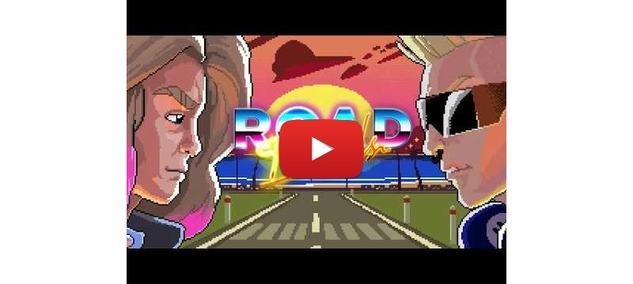
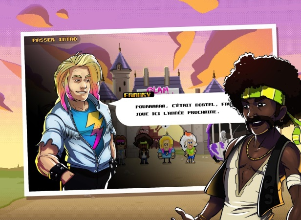
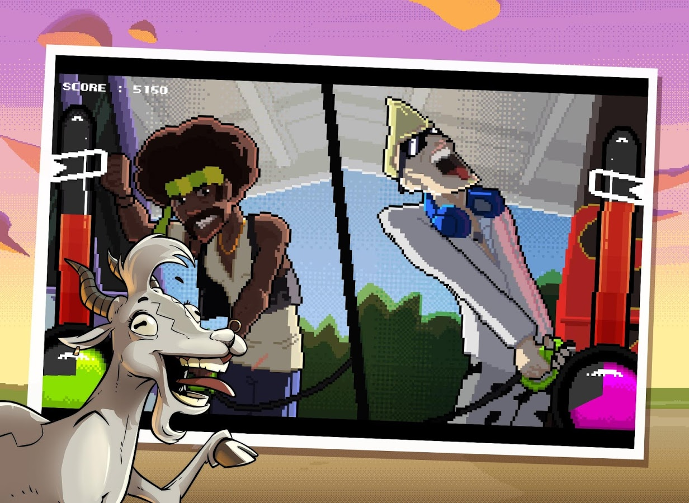

# ROAD BANDS, un jeu collaboratif par les hotelF1 !

    

hotelF1, réseau de motels à la française du groupe AccorHotels, va toujours plus loin dans l’univers de l’entertainment en proposant un jeu vidéo rétro (mobile et web) autour du road trip ! Dans Road Bands, vous devez aider un groupe de musique à retrouver leurs instruments et affronter leurs némésis. Mais attention, Road Bands n’est pas qu'un simple jeu vidéo, c’est un vrai projet collaboratif. Nous avons créé les 2 premiers niveaux, à vous de créer la suite !

    

## Sommaire

- [Le jeu](./README.md#le-jeu)
- [La Game Jam](#game-jam)
- [Les Prix](#prix)
- [Règlement du concours](#règlement)

## Le jeu

A la sortie d’un festival, le groupe de glam rock Slapp Machine décide de partir en road trip pour composer leur nouvel album. Mais les membres du groupe rival, les Zackhøuz, leur ont volé leurs instruments. Les Slapp Machine vont alors s’embarquer dans une course poursuite endiablée à travers des niveaux déjantés, mêlant runner et niveaux de boss, afin de récupérer leurs précieux instrus.

* Evitez les véhicules sur la route et rattrapez le van des Zackhøuz
* Affrontez Max le manager véreux lors d’une épique bataille de sandwich triangle
* Remplissez le réservoir de votre van le plus vite possible

Les Slapp Machine ont besoin de vous !

