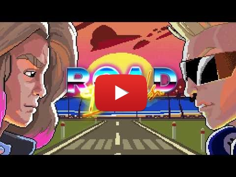

# ROAD BANDS, un jeu collaboratif par les hotelF1 !

    

hotelF1, réseau de motels à la française du groupe AccorHotels, va toujours plus loin dans l’univers de l’entertainment en proposant un jeu vidéo rétro (mobile et web) autour du road trip ! Dans Road Bands, vous devez aider un groupe de musique à retrouver leurs instruments et affronter leurs némésis. Mais attention, Road Bands n’est pas qu'un simple jeu vidéo, c’est un vrai projet collaboratif. Nous avons créé les 2 premiers niveaux, à vous de créer la suite !

    

## Sommaire

- [Jouer au jeu](./README.md#jouer-au-jeu)
- [Participer à la Game Jam](./README.md#participer-à-la-game-jam)
- [Les Prix](./README.md#les-prix)
- [FAQ](./README.md#faq)

## Jouer au jeu

À la sortie d’un festival, le groupe de glam rock Slapp Machine décide de partir en road trip pour composer leur nouvel album. Mais les membres du groupe rival, les Zackhøuz, leur ont volé leurs instruments. Les Slapp Machine vont alors s’embarquer dans une course poursuite endiablée à travers des niveaux déjantés, mêlant runner et niveaux de boss, afin de récupérer leurs précieux instrus.

* Évitez les véhicules sur la route et rattrapez le van des Zackhøuz
* Affrontez Max le manager véreux lors d’une épique bataille de sandwichs triangle
* Remplissez le réservoir de votre van le plus vite possible

Les Slapp Machine ont besoin de vous ! Retrouvez Road Bands [sur Android](https://play.google.com/store/apps/details?id=fr.hf1.roadband) et [sur iOS](https://itunes.apple.com/app/id1256521725) tout de suite et gratuitement !

## Participer à la Game Jam

*Informations sur l'évènement : date, où soumettre son jeu, lien vers la page d'explication du projet Unity, etc...*

## Les prix

À la fin de la Game Jam, tous vos niveaux seront testés par un jury qui sélectionnera alors 8 niveaux. Ces niveaux seront ensuite intégrés par nos équipes dans le jeu final, faisant de Road Bands un véritable jeu collaboratif ! Le jury devra décerner des prix à chacun des niveaux sélectionnés suivant son ordre de préférence.

- **Premier prix :** une mini borne d’arcade d’une valeur indicative de 1500 € TTC *(Laquelle ?)*
- **Deuxième et troisième prix :** une console de jeu d’une valeur indicative de 329,99€ *(Laquelle ?)*
- **Quatrième et cinquième prix :** une console de jeu d’une valeur indicative de 59,99 € *(Laquelle ?)*
- **Du sixième au huitième prix :** une console de jeu d’une valeur indicative de 54,99 € *(Laquelle ?)*

## FAQ

### Jusqu'à quand puis-je participer ?

### Puis-je participer seul(e) ?

### Jusqu'à combien de personnes peut compter mon équipe ?

### À qui dois-je envoyer mon niveau une fois celui-ci fini ?

### Puis-je créer plusieurs niveaux ?